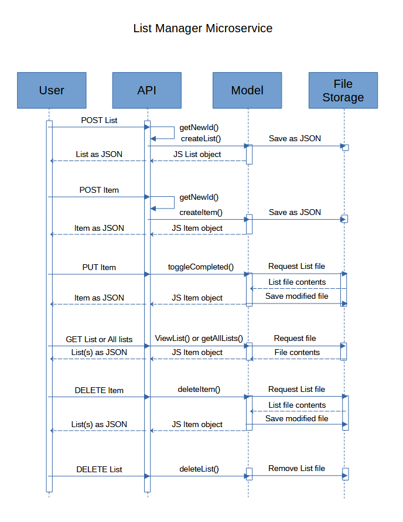

# List-Management-Microservice
Repository for Microservice 3, a List Management service.

Developers: Sean Bleyl & Valerie Armstrong

## Description

This microservice allows you to create and edit lists of items. Each item has an id, name, and completion status.

## Running the App

To run the app, save it to a directory within your project. Open that directory in a terminal, and run the command:

        node app.js

You should get a notice that the app is running in port 3000. If this conflicts with a port you're already using, just change the port number in the .env file.

## Requesting and Receiving Data

You can send and receive data from this microservice using HTTP. For all requesnts and responses with a body, data will be sent as JSON. We're including only the relevant portions of HTTP requests and responses here. If you want to learn more about HTTP requests and responses, check out ["Anatomy of an HTTP message" from MDN](https://developer.mozilla.org/en-US/docs/Web/HTTP/Guides/Messages).

If you're programming in JS, you can use the Fetch API to send HTTP requests. To learn more, check out ["Using the Fetch API from MDN"](https://developer.mozilla.org/en-US/docs/Web/API/Fetch_API/Using_Fetch)

If you're using Python, check out ["Requests: HTTP for Humans"](https://docs.python-requests.org/en/latest/index.html) to learn how to easily create HTTP requests.

### Sample HTTP Requests

 - To create a new list, send a POST request with the name of the list to http://your-server/api/lists

        POST / HTTP/1.1         // Request type
        Content-type: json      // Header

        {                                           // Body
            "list_name": "All the Things To Do"
        }

 - To create a new item, send a POST request with the name of the item to http://your-server/api/lists/:id/items. Note that you'll include the list id in the URL. This is the list where the item will appear.

        POST / HTTP/1.1
        Content-type: json

        {
            "item_name": "Thing to do."
        }

 - To view all the lists you've created, send a GET request to http://your-server/api/lists. Don't send a body with a GET request.

        GET / HTTP/1.1

### Available Actions

| Task                   | Request Type | URL (http://your-server + _____)  | Headers, if any     | Body content, if any                               |
| ---------------------- | ------------ | ------------------------------ | ------------------------------------------ | --------------------------- |
| Create new List        | POST         | /api/lists                     | Content-type: json  | { "list_name": "All my stuff to do" }      |
| Add an Item to a list  | POST         | /api/lists/:id/items *         | Content-type: json  | { "item_name": "All my stuff to do" }      |
| Toggle item completion | PUT          | /api/lists/:id/items/:itemId * |                     |                                            | 
| View all lists         | GET          | /api/lists                     |                     |                                            |
| View one list          | GET          | /api/lists/:id/items           |                     |                                            |
| Delete a List          | DELETE       | /api/lists/:id                 |                     |                                            |
| Delete an item from a list | DELETE   | /api/lists/:id/items/:itemId * |                     |                                            |

* *Note that the URL includes the id of the list where the item should be added

### Expected Responses

| Task                   | Result              | Status Code  | Response body, if any                               |
| ---------------------- | ------------------- | ------------ | --------------------------------------------------- |
| Create new list        | Success             | 201          | { id: list_id, list_name: "list name", items: [] }  |
| Create new list        | Failure             | 400 /500     | { error: 'Error message' }                          |
| Add an Item to a list  | Success             | 201          | { id: item_id, item_name: "item name", completed: false } |
| Add an Item to a list  | Failure             | 400 / 404 /500 | { error: 'Error message' }                        |
| Toggle item completion | Success             | 200          | { id: item_id, item_name: "item name", completed: bool } |
| Toggle item completion | Failure             | 404 / 500    | { error: 'Error message' }                          |
| View all lists         | Success             | 200          | { all: [ {id:..., list_name:..., items: []}, ... {id: ...} ] }    |
| View all lists         | Failure             | 500          | { error: 'Error message' }                          |
| View one list          | Success             | 200          | { id: list_id, list_name: "list name", items: [] }  |
| View one list          | Failure             | 404          | { error: 'Error message' }                          |
| Delete a list          | Success             | 204          |                                                     |
| Delete a list          | Failure             | 404 / 500    | { error: 'Error message' }                          |
| Delete an item from a list | Success         | 204          |                                                     |
| Delete an item from a list | Failure         | 404 / 500    | { error: 'Error message' }                          |

## UML Sequence Diagram

